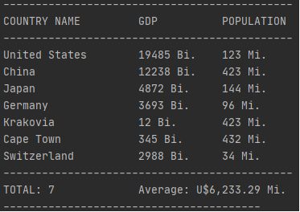

 
    # GDP_Data_Science
    

    <h3>English:</h3>
    A simple script that allows you to add new countries and their respective gdp and population, and give you a some options about showing them, and with some data science about them envolved. The script creates, or open a text file.
    There's also a built in function for a better showing of the data. 

    

    <h3>Português:</h3>
    Um script simples que possibilita a addição de novos países, convertendo tudo em um novo, ou abrindo um já existente arquivo de texto. O script consta com um pouco de data science como a média de pib dos países envolvidos.
    Há também disponível uma função própria para uma melhor apresentação dos dados. 

 

 

